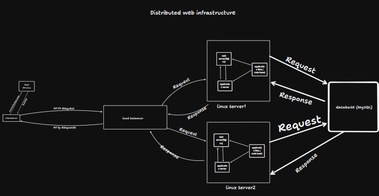

# Distributed Web Infrastructure

## Description

This is a distributed web infrastructure that atttempts to reduce the traffic to the primary server by distributing some of the load to a replica server with the aid of a server responsible for balancing the load between the two servers (primary and replica).

## Load Balancer (HAProxy)

**Purpose**: Distributes incoming web traffic across multiple servers to ensure high availability and reliability.

**Algorithm**:
- **Round Robin**: This algorithm distributes client requests sequentially across the pool of servers.
- **How it works**: Each new request is forwarded to the next server in the list. Once the end of the list is reached, it starts over from the beginning.

**Active-Active Setup**: Both the web server and the application server are actively handling requests, improving resource utilization and availability. In contrast, an Active-Passive setup has one server active and the other on standby, only taking over if the active server fails.

## Web Server (Nginx)

**Purpose**: Handles HTTP requests, serves static content (e.g., images, CSS, JavaScript), and forwards dynamic content requests to the application server.

**Reason**: Nginx is chosen for its high performance and ability to handle a large number of concurrent connections.

## Application Server

**Purpose**: Runs the application code, processes business logic, and generates dynamic content.

**Reason**: Separating the application logic from the web server allows for better scalability and manageability.

## Database (MySQL)

**Primary Node**: Handles all write operations and synchronizes data with the Replica node.

**Replica Node**: Handles read operations and provides redundancy. It receives data from the Primary node to ensure it has an up-to-date copy of the database.

### Database Primary-Replica (Master-Slave) Cluster

**How it works**: The Primary node processes all write requests and replicates the data to the Replica node. The Replica node can be used to offload read requests from the Primary, enhancing performance and ensuring redundancy.

- **Primary Node**: Handles both read and write operations.
- **Replica Node**: Primarily handles read operations and acts as a backup to ensure data availability and durability.

## Issues with This Infrastructure

### Single Points of Failure (SPOF)

- **The Load Balancer**: If the HAProxy server goes down, the entire system becomes unavailable.
- **Database**: If the Primary node fails and there's no automatic failover mechanism, the system can't process write operations.

### Security Issues

- **No Firewall**: Without a firewall, the system is vulnerable to attacks.
- **No HTTPS**: Without HTTPS
