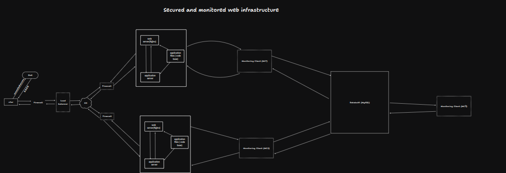

# Simple Web Stack

## Explanation of Each Element

### Firewalls:

- **Purpose**: Protect the infrastructure by controlling incoming and outgoing network traffic based on predetermined security rules.
  - **Firewall 1**: Protects the load balancer from external threats.
  - **Firewall 2**: Protects the web server.
  - **Firewall 3**: Protects the application server.

### SSL Certificate:

- **Purpose**: Enables HTTPS to secure data transmission between clients and the server by encrypting the traffic.
- **Placement**: SSL termination occurs at the load balancer, which means the load balancer handles the SSL/TLS decryption.

### Monitoring Clients:

- **Purpose**: Monitoring clients collect data on server performance, resource usage, and application health.
- **Reason**: Helps in proactively identifying and resolving issues, ensuring optimal performance and uptime.
- **Placement**:
  - **MC1**: Installed on the web server.
  - **MC2**: Installed on the application server.
  - **MC3**: Installed on the database server.
- **How it works**: Data collectors send performance metrics and logs to a monitoring service like Sumologic for analysis and visualization.

## Detailed Functionality and Issues

### Firewalls:

- **What are they for**: Firewalls protect against unauthorized access, DDoS attacks, and other network threats by filtering traffic based on security rules.

### HTTPS:

- **Why serve traffic over HTTPS**: HTTPS encrypts data in transit, ensuring confidentiality, integrity, and authenticity of the data exchanged between clients and the server. It protects against man-in-the-middle attacks.

### Monitoring:

- **Purpose**: Monitoring is used to track the health, performance, and usage of the infrastructure. It helps in detecting and diagnosing issues, performance bottlenecks, and potential failures.
- **Data Collection**: Monitoring tools collect data such as CPU usage, memory usage, disk I/O, network traffic, error logs, and custom application metrics. This data is sent to a central monitoring service (like Sumologic) for analysis.
- **Monitoring QPS**: To monitor Queries Per Second (QPS) on the web server, configure the monitoring client to collect HTTP request metrics. Set up dashboards and alerts in the monitoring service to track QPS and notify if it exceeds certain thresholds.

## Issues with the Infrastructure

### Terminating SSL at the Load Balancer Level:

- **Issue**: If SSL is terminated at the load balancer, traffic between the load balancer and the backend servers is unencrypted. This can expose sensitive data if the internal network is compromised.
- **Mitigation**: Implement end-to-end encryption by configuring SSL on both the load balancer and the backend servers.

### Single MySQL Server for Writes:

- **Issue**: If the Primary node fails, no write operations can be performed, causing potential data loss or downtime.
- **Mitigation**: Implement a failover mechanism with an additional MySQL server ready to become the new Primary node.

### Servers with All Same Components:

- **Issue**: Combining web server, application server, and database on the same physical server can lead to resource contention, where different services compete for CPU, memory, and I/O.
- **Mitigation**: Separate these services into different physical or virtual machines to ensure optimal performance and resource allocation.
